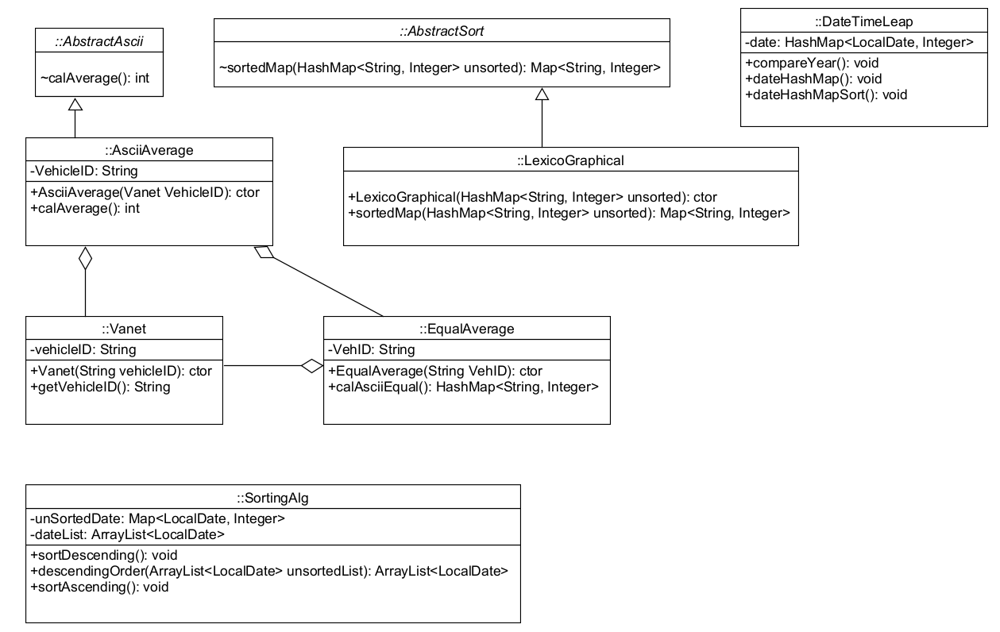

# Project 3: Hashmap with VANET

## AsciiAverage
- AsciiAverage(VehicleID Vanet) Constructor to initialize the Vehicle ID, the vehicle ID which will be calculated the ASCII average (vh0000)
- calAverage() The method to calculate the average of the VehicleID, return the average of VehicleID. This method to find the average of each VehicleID base on the character and the length of the VehicleID. First, add up the sum of each letter by ascii number of it, then 
calculate the average. Compare the difference between average and the round down of it with 0.5. If the difference of them is less than 0.5 then round down the average.
Round up the average if the difference of them is greater than 0.5. 

## DateTimeLeap
- compareYear() Method to compare the date of the current date and the local date, first the local date after taking from the file will be put in the Map with the value start from 
1, then I will use the function of the class Period to compare the date between the local date and current date.
- dateHashMap() Method to put the local date into the Map and print it out
- dateHashMapSort() Method to sort the local date of the map using TreeMap, and print the output after sorting with the right format

## EqualAverage
- EqualAverage(VehID String) Constructor to initialize the vehicle ID
- calAsciiEqual() Method to compare the ASCII average of the local vehicleID with VehID (veh0000), return the map with the vehicle ID which have average equal to VehID(veh0000).

## LexicoGraphical
- LexicoGraphical(HashMap<String, Integer> unsorted) Constructor to sort the given unsoreted map of vehicle ID
- sortedMap(HashMap<String, Integer> unsorted) Method to sort the map of the vehicle ID

## SortingAlg 
- sortDescending() Method to sort the list of date in data file in descending order
- descendingOrder (ArrayList<LocalDate> unsortedList) Algorithm to sort the list of date in descending order. The idea of sorting the date list in descending order or ascending is that I will compare 
the year of the date list. If the year is same then I will compare the month of them. If both year and month are same then I will compare the day. First I will make a nested loop and compare the first 
element of the list to the other elementsof the list if there is a element which is greater than the first element of the list then I will assign the first element to that element. 
- sortAscending()  Algorithm to sort the list of date in descending order. First I will make a nested loop and compare the first element of the list to the other elements
of the list if there is a element which is less than the first element of the list then I will assign the first element to that element.

## The difference between two execution times
Execution time for the case 1: 21093200 (sort descending)
Execution time for the case 2: 1263600 (sort ascending)

From the execution time, we can see that the execution time of sort in descending order is greater than sort in ascending order. The difference of both cases is about 0.02 second.
Both cases are different because they depend on the data. For example, if I sort in ascending order and the data was like 1 2 3 5 4 then if I use the nested loop to move the element,
I only have to move 4 and 5 to get the right order. Howeverm if I try to sort the array in descending order then I have to swap more elements to get the right order. From that the 
execution time of descending order will be greater than the execution time of the ascending order.

for k = 1:50
    if(mod(k,2)~= 0)
    x = a(k)*cos(k*w0.*t) + b(k)*sin(k*w0.*t);
    end
end
y = a0 + sum(x);

plot(t,x);